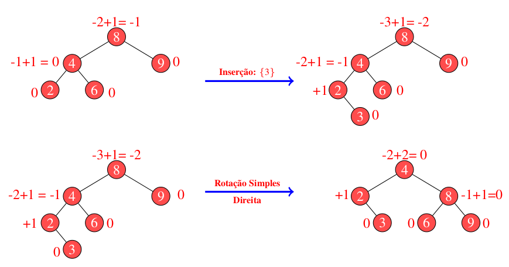

# Sugestoes-de-palavras

## Problema proposto
<p align="justify">
Neste trabalho, o objetivo foi criar um sistema que possibilite a funcionalidade de autocompletar e oferecer sugestões de palavras aos usuários. Para atingir essa finalidade, foi adotado a estrutura da árvore binária como base. Ao iniciar o codigo, é lido um arquivo denominado input.data, contendo uma lista de palavras. Cada palavra nesse arquivo é considerada como termo de pesquisa para o sistema. Foi utilizado um conjunto de árvores binárias para construir o sistema. Essas árvores foram criadas a partir de textos previamente fornecidos (disponíveis na pasta dataset). O objetivo é estabelecer uma relação entre as palavras dos textos e as palavras de pesquisa. Para cada palavra no arquivo input.txt, é percorrido as árvores binárias para identificar a palavras mais relevantes e próximas à palavra de pesquisa. Foram priorizadas as palavras frequentes e associadas ao termo de pesquisa.

## Lógica implementada
<p align="justify">
Para resolver esse problema assim como no trabalho anterior (Top-K-elementos), foi utilizado a hash para contar a frequência de todos os itens, enquanto o heap se aplica na manutenção de uma lista dos k itens de maior valor. Para implementar a tabela hash foi usada a biblioteca <i>unordered_map</i> que permite criar uma hash com mais facilidade. Para implementar a heap foi usada a biblioteca <i>queue</i> utilizando a priority_queue como estrutura. Por fim foi usado uma struct <i>Item</i> para armazenar uma palavra e sua frequencia. Essa frequencia será utilizada depois para montar as árvores binarias, que serão construidas apenas se alguma palavra do arquivo 'input.txt' for encontrada no texto que está sendo analisado. Caso alguma palavra seja encontrada, são montada as 3 árvores : Árovre binária, AVL e a Árvore de Huffman contendo as palavras mais frequentes que estão armazenadas na heap. Os resultados da análise são apresentados em um arquivo chamado output.txt. Esse arquivo contém as relações entre as palavras pesquisadas e cada arquivo de texto. Além disso, a relevância de cada palavra é calculada com base em sua frequência nos textos. Para tal, foi utilizado o trabalho recentemente realizado, o contador de palavras.

### Hash
<p align="justify">
Como foi dito, para implementar a tabela hash foi usado a estrutura <i>unordered_map</i> que é uma classe de contêiner da biblioteca padrão do C++. Esse tipo de estrutura é usado para armazenar pares de chave-valor, onde cada chave é única e mapeia para um valor correspondente. O <i>unordered_set</i> oferece acesso rápido aos valores com base em suas chaves. Neste caso as chaves são do tipo string (representando as palavras) e os valores são do tipo int (representando as frequências das palavras).  Se a palavra já estiver presente na tabela, sua frequência é incrementada. Se não estiver presente, uma nova entrada é criada com frequência 1.

<p align="justify">
Como em qualquer tabela de dispersão, pode ocorrer colisões quando duas chaves diferentes geram o mesmo valor de hash. As técnicas para lidar com colisões variam, mas a biblioteca padrão do C++ geralmente utiliza o método de "encadeamento" para resolver essas situações. No método de encadeamento, cada posição da tabela de dispersão contém uma lista ligada de elementos que possuem o mesmo valor de hash. Quando ocorre uma colisão, um novo elemento é simplesmente adicionado à lista ligada correspondente. O encadeamento é uma técnica eficaz para lidar com colisões, mas ele pode causar aumento no uso de memória devido à necessidade de armazenar as listas ligadas. No entanto, essa abordagem oferece um bom desempenho médio para inserção, busca e remoção de elementos, tornando o unordered_map uma estrutura de dados poderosa e versátil para lidar com mapeamentos de chave-valor. 

### Heap
<p align="justify">
Uma heap é uma estrutura de dados fundamental que organiza um conjunto de elementos de forma hierárquica, de modo que o elemento pai tenha um valor maior ou menor (dependendo do tipo de heap) do que seus filhos. A heap é frequentemente usada para implementar filas de prioridade, onde os elementos são acessados com base em sua prioridade relativa, o que foi o caso deste trabalho, já que foi usada uma priority_queue que usa uma heap como sua estrutura de armazenamento subjacente. Essa heap garante que os elementos sejam organizados de acordo com a prioridade, com o elemento de maior (ou menor) prioridade no topo. No contexto do código, a heap foi usada para manter os "k" elementos mais valiosos (mais frequentes) durante o processo de contagem de frequência das palavras. Isso permitiu que fosse identificado rapidamente os elementos mais valiosos em termos de frequência à medida que processa as palavras do texto.

### Árvore Binária
<p align="justify">
Uma árvore binária é uma estrutura de dados em que cada nó pode ter até dois filhos, conhecidos como filho esquerdo e filho direito. A estrutura de uma árvore binária é composta por nós, onde cada nó pode conter algum dado ou valor, e esses nós são organizados hierarquicamente de forma que um nó pai pode ter no máximo dois filhos. Quando um nó não possui filhos, ou seja, seus ponteiros de filho esquerdo e direito estão livres ou com valores como NULL, chamados esse nó de folha e consideramos que este tipo de nó delimita o "fundo" da estrutura. A Fig. 1 detalha em alto nível esse modelo de estrutura de dados em detalhes.

<p align="center">
 
</p>

<p align="center"> Fig 1. Exemplo de árvore binaria. </p>

<p align="justify">
A partir da Fig. 1 é possível observar algumas características importantes da estrutra em árvore. Primeiro, a estrutura detalha sua altura computando os níveis de hierarquia. No exemplo, é possível observar que, partindo do nó raiz (i.e., 5), temos como altura da árvore 3, considerando que a raiz se encontra em nível zero. Assim, identificar a altura de uma estrutura em árvore é equivalente a econtrar, partindo-se da raiz, o nó folha mais profundo existente. Observe na Fig. 1, que todo nó da estrutura apresenta no máximo dois filhos. Isso caracteriza a estrutura como binária, cujos nós são, no máximo, de grau 2. Consideramos como grau a quantidade de ponteiros conectados em um determinado nó.
<p align="justify">
Por fim, ainda utilizando da representação da Fig. 1, podemos observar que é possível identificar a altura da estrutura. Em literatura, uma árvore binária balanceada apresenta como altura o fator de logn, com n representando o número de elementos inseridos. Esse balanceamento é obtido mantendo-se todas as folhas em níveis muito próximos, sendo aceitável uma variação de no máximo 1 de altura para variações. Consideramos esse contexto como caso médio, isso se considerarmos que as inserções são sempre realizadas a partir de valores aleatórios não ordenados. Caso contrário, se valores ordenados forem utilizados tem-se a possibilidade da altura ser linear em relação ao tamanho da entrada. Nesse último caso, a estrutura passará a apresentar ligações muito semelhantes a uma lista simplesmente encadeada e seus custos passam a acompanhar os já apresentados nesta estrutura.
<p align="justify">
Para este projeto o nó da árvore binaria foi feito com uma struct que contém a palavra, sua frequência e os ponteiros right e left que representam os filhos esquerdo e direito de um nó na árvore binária, além de um construtor que é usado para criar um novo objeto Binaria. Ele aceita dois argumentos: uma palavra (como uma string) e uma frequência (como um inteiro). Quando um novo nó é criado, esse construtor é usado para inicializar os valores dos membros word e frequency, enquanto left e right são inicializados como ponteiros nulos (nullptr).

```cpp
struct Binaria {
    string word;
    int frequency;
    Binaria* left;
    Binaria* right;

    vector<string> palavras;

    Binaria(string word, int freq) : word(word), frequency(freq),  left(nullptr), right(nullptr) {}
};
```

#### Função insert
<p align="justify"> 
Para inserir os elementos na árvore binaria foi cirada a função 'insert' que é uma função recursiva que insere um novo nó na árvore. A função recebe 3 argumentos, Binaria* root que é um ponteiro para a raiz da árvore, string word que é a palavra que será inserida e int frequency que é a frequência desta palavra. Primeiro, a função verifica se o nó raiz (root) é nulo. Se for nulo, isso significa que a árvore está vazia ou que foi alcançada uma folha da árvore onde um novo nó pode ser inserido. Nesse caso, a função cria um novo nó Binaria com os valores word e frequency passados como argumentos e retorna um ponteiro para esse novo nó, efetivamente adicionando-o à árvore. Se o nó raiz não for nulo, a função verifica se a frequency do novo nó é menor do que a frequency do nó atual (root). Se for menor, isso significa que o novo nó deve ser inserido à esquerda do nó atual. A função chama recursivamente a função insert no filho esquerdo (root->left) e atualiza o filho esquerdo do nó atual com o resultado dessa chamada.Se a frequency do novo nó for maior do que a frequency do nó atual, a função chama recursivamente a função insert no filho direito (root->right) e atualiza o filho direito do nó atual com o resultado dessa chamada. Se a frequency do novo nó for igual à frequency do nó atual, isso significa que a palavra já existe na árvore com a mesma frequência. Nesse caso, a palavra é adicionada ao vetor palavras do nó atual.
<p align="justify"> 
Finalmente, a função retorna o nó atual (ou o novo nó criado no caso da raiz ser nula ou o nó original com atualizações) após a inserção. A função garante que o nós são organizados de forma que os valores menores estão à esquerda e os valores maiores estão à direita, garantindo que a árvore seja ordenada de acordo com o critério de frequência. Vale ressaltar que como a inserção na arvore binaria é feita pegando os elementos da heap que está ordenada de acordo com a frequência, a função 'insert' acaba
inserindo todos os elementos na sub-árvore da direita (já que os elementos da heap estão em ordem crescente), o que gera um desbalanceamento na árvore tranformando ela em uma lista linear. Esse problema é resolvido na próxima estrutura usada, a árvore AVL, por isso resolvi deixar desta forma.

```cpp
Binaria* insert(Binaria* root, string word, int frequency) {
    if (root == nullptr) {
        return new Binaria(word, frequency);
    }

    if (frequency < root->frequency) {
        root->left = insert(root->left, word, frequency);
    }

    else if(frequency > root->frequency){
        root->right = insert(root->right, word, frequency);
    }

    else{
        root->palavras.push_back(word);
    }

    return root;
}
```

> Vale ressaltar que os elementos que são inseridos na árvore são os elementos que estão na heap que contém as palarvas mais frequentes do texto. Essa heap está ordenada, ou seja, a função 'insert' irá inserir todos os nós na sub-arvore da direita (já que a heap esta ordenada de forma crescente), gerando um desbalanceamento e transformando a árvore em uma lista linear. Este problema é resolvido na próxima estrutura, a árvore AVL, por isso deixei desta forma.

### AVL
<p align="justify"> 
Uma árvore AVL é uma estrutura de dados de árvore binária balanceada que foi projetada para manter o equilíbrio automático durante operações de inserção e remoção. O equilíbrio de uma árvore AVL é uma propriedade importante que garante que a altura das subárvores esquerda e direita de qualquer nó seja no máximo 1. Isso resulta em um desempenho de busca eficiente, com uma complexidade de tempo logarítmica em relação ao número de nós. Para a realização dos balanceamentos, a AVL modifica o método de inserção da árvore binária, introduzindo nela um procedimento de avaliação de peso e quatro modelos de rotação. O fator de peso é utilizado para identificar quando a árvore se apresenta desbalanceada, para com isso identificar que tipo de rotação é preciso empregar na estrutura para que essa volta e se manter aproximadamente balanceada. A abordagem do fator de peso pode ser observada através da Fig 2.

<p align="center">
 
</p>

<p align="center"> Fig 2. Exemplo de árvore AVL. </p>

<p align="justify"> 
Observe, por meio da representação da Fig 2, que os fatores de peso podem se apresentar entre -1 e +1. Isso demonstra que a árvore em questão está balanceada segundo suas regras. Para obter esse fator de peso, consideramos a avaliação do nível de altura do filho mais profundo de cada sub-árvore (i.e., esquerda e direita). Quando uma sub-árvore esquerda é avaliada, seu valor de peso se apresenta como negativo. Pelo contrário, quando a sub-árvore direita é observada, essa leva para os níveis mais acima valores positivos de altura. Então, uma árvore AVL se encontra desbalanceada se o fator de peso de um dado nó excede o limiar entre -1 e +1. Neste caso, as rotações são realizadas para retornar a estrutura à condições aceitáveis.
<p align="justify"> 
Em uma árvore AVL desbalanceada, um total de 4 rotações podem ser realizadas, duas simples e duas duplas. Considera-se rotações simples esquerda e/ou direita a movimentação da estrutura em um único processo. Essas são aplicadas sempre que o fator de peso do nó desbalanceado coincidir em sinal com a sub-árvore que levou ao desbalanceamento. Observe abaixo na Fig 3 um exemplo de rotação simples para direita. Neste, note que o sinal dos fatores de peso do nó que gerou o desbalanceamento (i.e., nó 8) e da sub-árvore causadora do mesmo (i.e., 4) são iguais. Isso caracteriza uma rotação simples para direita, uma vez que ambos os sinais são negativos, o que indica que o desbalanceamento gerado está na esquerda.

<p align="center">
 
</p>

<p align="center"> Fig 3. Exemplo de rotação à direita para rebalanceameto da árvore binária. </p>

<p align="justify"> 
Considerando ainda o exemplo da Fig 3, observe que ao produzir o rebalanceamento necessário, neste caso, obtivemos duas grandes modificações. Primeiro, como o desbalanceamento ocorreu na raiz da árvore, essa sofreu modificação, deixando de ser o nó 8 para se tornar o nó 4. Segundo, o filho direito de 4, representado pelo nó 6, deixa de conectar a ele para se tornar o filho esquerdo do nó 8. Esse segundo passo é necessário para garantir a integridade das regras básicas de uma árvore binária, a qual define a existência de apenas um filho na esquerda e um como filho direito. Então, ao imaginar a rotação é preciso observar essas peculiaridades para não errar a recomposição da estrutura. Vejamos agora como proceder sob modelos de rotação dupla. A Fig 4 detalha um exemplo para este caso.

<p align="center">
 
</p>

<p align="center"> Fig 4. Exemplo de rotação dupla à direita para rebalanceameto da árvore binária. </p>

<p align="justify"> 
Em uma rotação dupla, conforme pode ser observado na Fig 3, dois movimentos são necessários. Para detecnar a necessidade desses movimentos, basta observar o sinal atribuído ao fator de do nó desbalanceado e o da sub-árvore causadora do problema. Note que, o nó desbalanceado mais uma vez é o nó cujo valor é 8. Nesse nó temos um fator de peso de -2, o que indica um desbalanceamento de sua sub-árvore esquerda. Já em sua sub-árvore esquerda observamos um fator de peso positivo, o que indica a necessidade de rotação dupla para correção. Neste caso, primeiramente produzimos uma rotação simples na sub-árvore esquerda para igualar seu sinal de fator de peso ao sinal do nó desbalanceado. Feito isso, produzimos uma segunda rotação ao contrário para corrigir o nó sinalizado no início como desbalanceado. Note que ao produzir rotações nos filhos, valores maiores que 1 podem ser produzidos, como no caso do nó 6 que recebeu após rotação um fator de -2. Embora saibamos que esse valor indica desbalanceamento, este é ignorado, uma vez que, tal fator só foi produzido após rotação de correção. Além disso, observe que para alinhar corretamente a estrutura, os nós de valor 5 e 6 foram realinhados. Isso é preciso porque ao realizar a rotação sem o realinhamento a composição da árvore ficará errada, tendo como filho direito do nó 6 o nó cujo valor é 5. Então, ao detectar uma rotação dupla, observe se o primeiro giro fará com que a integridade da estrutura se mantenha. Caso contrário, faça primeiro o alinhamento conforme demonstrado no exemplo, depois gire a estrutura.

<p align="justify"> 
Para este projeto o nó da árvore AVl foi feito com uma struct que contém a palavra, sua frequência, os ponteiros right e left que representam os filhos esquerdo e direito de um nó na árvore binária, a altura do nó e um construtor.

```cpp
struct AVL {
    string word;
    int frequency;
    AVL* left;
    AVL* right;
    int height;

    vector<string> palavras;

    AVL(string w, int f): word(w), frequency(f), left(nullptr), right(nullptr), height(1) {}
};
```

#### Função insert
<p align="justify"> 
Para inserir os elementos na AAVL foi criada a função 'insert' que recebe 3 argumentos, 'AVL* root' que é um ponteiro para a raiz da árvore AVL, string word que é a palavra que será inserida e int frequency que é a frequência desta palavra. Primeiro, a função verifica se o nó raiz (root) é nulo. Se for nulo, isso significa que a árvore está vazia ou que foi alcançada uma folha da árvore onde um novo nó pode ser inserido. Nesse caso, a função cria um novo nó AVL com os valores word e frequency passados como argumentos e retorna um ponteiro para esse novo nó. Se o nó raiz não for nulo, a função compara a frequency do novo nó com a frequency do nó atual (root). Com base nessa comparação, a função decide se o novo nó deve ser inserido na subárvore esquerda ou direita do nó atual. Após a inserção do novo nó, a altura do nó atual (root) é atualizada com base na altura máxima entre suas subárvores esquerda e direita. A função calcula o fator de equilíbrio do nó atual chamando a função getBalanceFactor(root). O fator de equilíbrio é a diferença entre as alturas da subárvore esquerda e da subárvore direita. A função verifica se ocorreu um desequilíbrio na árvore. Se o fator de equilíbrio for maior que 1, isso indica um desequilíbrio na subárvore esquerda. Dependendo da relação entre a frequency do novo nó e a frequency do filho esquerdo do nó atual, são realizadas rotações para restaurar o equilíbrio. Da mesma forma, se o fator de equilíbrio for menor que -1, isso indica um desequilíbrio na subárvore direita, e novamente são realizadas rotações apropriadas. A função retorna o nó atual (ou o novo nó criado no caso da raiz ser nula ou o nó original com atualizações) após a inserção e o balanceamento.

```cpp
AVL* insert(AVL* root, string word, int frequency) {
    if (root == nullptr) {
        return new AVL(word, frequency);
    }
    if (frequency < root->frequency) { // Insere na subárvore esquerda se a frequência for menor
        root->left = insert(root->left, word, frequency);
    } 
    else if (frequency > root->frequency) {
        root->right = insert(root->right, word, frequency);
    } 
    else { // Caso a frequência seja igual
       root->palavras.push_back(word);
    }

    root->height = 1 + max(getHeight(root->left), getHeight(root->right));

    int balance = getBalanceFactor(root);   

    // Casos de desequilíbrio
    if (balance > 1) {
        if (frequency < root->left->frequency) {
            // Rotação simples à direita
            return rightRotate(root);
        } 
        else {
            // Rotação dupla à esquerda-direita
            root->left = leftRotate(root->left);
            return rightRotate(root);
        }
    }
    if (balance < -1) {
        if (frequency > root->right->frequency) {
            // Rotação simples à esquerda
            return leftRotate(root);
        } 
        else {
            // Rotação dupla à direita-esquerda
            root->right = rightRotate(root->right);
            return leftRotate(root);
        }
    }

    return root;
}
```

#### Função getHeight
<p align="justify"> 
Esta função calcula a altura de um nó na árvore AVL. Ela recebe um nó (AVL* node) como argumento e retorna a altura desse nó. Se o nó for nulo (representando uma subárvore vazia), a altura é considerada como 0.

```cpp
int getHeight(AVL* node) {
    if (node == nullptr)
        return 0;
    return node->height;
}
```

#### Função getBalanceFactor
<p align="justify"> 
Esta função calcula o fator de equilíbrio de um nó na árvore AVL. O fator de equilíbrio é a diferença entre as alturas da subárvore esquerda e da subárvore direita do nó. Se o nó for nulo, o fator de equilíbrio é considerado como 0.

```cpp
int getBalanceFactor(AVL* node) {
    if (node == nullptr)
        return 0;
    return getHeight(node->left) - getHeight(node->right);
}
```

#### Função rightRotate
<p align="justify"> 
Esta função realiza uma rotação simples para a direita em torno do nó y na árvore. Ela recebe o nó y como argumento e retorna o novo nó que se tornará a raiz da subárvore que antes tinha y como raiz. Um novo nó x é criado e recebe o filho esquerdo de y como seu filho direito. Isso significa que x "herda" o filho esquerdo de y. O filho esquerdo de y (x->right) agora se torna o filho esquerdo de y. Portanto, y perde seu filho esquerdo. Em seguida, as alturas de y e x são atualizadas. A altura de y é recalculada como a altura máxima entre suas novas subárvores esquerda e direita mais 1. A altura de x também é recalculada da mesma maneira. Finalmente, a função retorna o novo nó x, que agora é a raiz da subárvore onde a rotação ocorreu.

```cpp
AVL* rightRotate(AVL* y) {
    AVL* x = y->left;
    AVL* T2 = x->right;

    x->right = y;
    y->left = T2;

    y->height = max(getHeight(y->left), getHeight(y->right)) + 1;
    x->height = max(getHeight(x->left), getHeight(x->right)) + 1;

    return x;
}
```

#### Função leftRotate
<p align="justify"> 
Esta função realiza uma rotação simples para a esquerda em torno do nó x na árvore. Ela recebe o nó x como argumento e retorna o novo nó que se tornará a raiz da subárvore que antes tinha x como raiz. Um novo nó y é criado e recebe o filho direito de x como seu filho esquerdo. Isso significa que y "herda" o filho direito de x. O filho direito de x (y->left) agora se torna o filho direito de x. Portanto, x perde seu filho direito. Em seguida, as alturas de x e y são atualizadas. A altura de x é recalculada como a altura máxima entre suas novas subárvores esquerda e direita mais 1. A altura de y também é recalculada da mesma maneira. Finalmente, a função retorna o novo nó y, que agora é a raiz da subárvore onde a rotação ocorreu.

```cpp
AVL* leftRotate(AVL* x) {
    AVL* y = x->right;
    AVL* T2 = y->left;

    y->left = x;
    x->right = T2;

    x->height = max(getHeight(x->left), getHeight(x->right)) + 1;
    y->height = max(getHeight(y->left), getHeight(y->right)) + 1;

    return y;
}
```

### Árvore de Huffman
<p align="justify">
A árvore de Huffman é uma estrutura de dados e um algoritmo usado para compressão de dados sem perda. O principal objetivo da árvore de Huffman é representar um conjunto de dados de forma eficiente, atribuindo códigos de comprimento variável a cada símbolo, de modo que símbolos frequentes tenham códigos mais curtos e símbolos menos frequentes tenham códigos mais longos. O processo de compressão começa com uma análise dos dados de entrada para determinar a frequência de ocorrência de cada símbolo (por exemplo, caracteres em um arquivo de texto, bytes em um arquivo binário). Isso envolve contar quantas vezes cada símbolo aparece nos dados. A partir das frequências dos símbolos, é construída uma árvore binária especial chamada de árvore de Huffman. A árvore começa com uma folha para cada símbolo, onde cada folha tem uma frequência associada. Em seguida, a árvore é construída em etapas, combinando os dois nós (folhas ou subárvores) de menor frequência em um novo nó pai. Esse processo continua até que todos os nós estejam combinados em um único nó raiz. À medida que a árvore de Huffman é construída, são atribuídos códigos binários únicos a cada símbolo. Os códigos são derivados seguindo o caminho da raiz da árvore até a folha que representa o símbolo. Os símbolos mais frequentes têm códigos mais curtos, enquanto os símbolos menos frequentes têm códigos mais longos. Um importante aspecto da árvore de Huffman é que nenhum código é um prefixo de outro código. Isso significa que você pode sempre decodificar os dados de forma única, lendo os códigos um por um, sem ambiguidade.

<p align="center">
 
</p>

<p align="justify">
Uma vez que a árvore de Huffman está construída e os códigos são atribuídos aos símbolos, os dados de entrada são substituídos por seus códigos correspondentes. Isso resulta em uma representação mais compacta dos dados originais. A compressão ocorre porque os códigos são mais curtos para os símbolos mais frequentes. Para descompactar os dados, é necessário ter acesso à mesma árvore de Huffman utilizada para a compressão. Os códigos nos dados compactados são lidos um por um, e a árvore de Huffman é usada para mapear os códigos de volta para os símbolos originais.A eficiência da árvore de Huffman depende das frequências dos símbolos nos dados originais. Quanto mais desequilibrada a distribuição de frequências, maior a compressão que pode ser alcançada.

<p align="justify">
Assim como nas outras duas arvores, o nó da árvore de Huffman foi feito usando uma struct contendo os ponteiros representando os filhos direito e esqeuerdo, a palavra e seua frequência, além de um construtor. Existe tambem um operador que permite comparar dois objetos Huffman. Ele compara os objetos com base em suas frequências. Se o objeto atual (this) tiver uma frequência maior do que o objeto other, a função retornará true, indicando que o objeto atual tem uma frequência maior.

```cpp
struct Huffman {
    string word;
    int frequency;
    Huffman* left;
    Huffman* right;

    Huffman(string word, int frequency) : word(word), frequency(frequency), left(nullptr), right(nullptr) {}

    bool operator>(const Huffman& other) const {
        return frequency > other.frequency;
    }
};
```
#### Função MakeHuffmanTree
<p align="justify">


## Resultado

## Conclusão
<p align="justify">
Ao concluir este trabalho, obtivemos uma compreensão mais aprofundada das diferentes implementações das árvores binárias e sua influência no sistema de autocompletar e sugestões de palavras. A análise comparativa nos permite avaliar a eficácia de cada abordagem em termos de desempenho e funcionalidade.

 
## Compilação e Execução

Esse pequeno exemplo possui um arquivo Makefile que realiza todo o procedimento de compilação e execução. Para tanto, temos as seguintes diretrizes de execução:


| Comando                |  Função                                                                                           |
| -----------------------| ------------------------------------------------------------------------------------------------- |
|  `make clean`          | Apaga a última compilação realizada contida na pasta build                                        |
|  `make`                | Executa a compilação do programa utilizando o gcc, e o resultado vai para a pasta build           |
|  `make run`            | Executa o programa da pasta build após a realização da compilação                                 |
